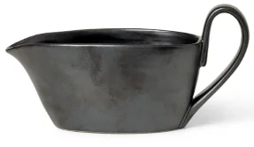

# nebb

Where sauce is stored.

A place to store and retrieve [SALSA](https://github.com/nais/salsa/) attestations. Maybe it will end up as a full blown 
solution with search and fancy display capabilities?

## ⌨️ Usage

TBD

## ⚖️ License
[MIT](LICENSE).

## 👥 Contact

This project is maintained by [@nais](https://github.com/nais).

Questions and/or feature requests? Please create an [issue](https://github.com/nais/nebb/issues).

If you work in [@navikt](https://github.com/navikt) you can reach us at the Slack channel [#nais](https://nav-it.slack.com/archives/C5KUST8N6).

